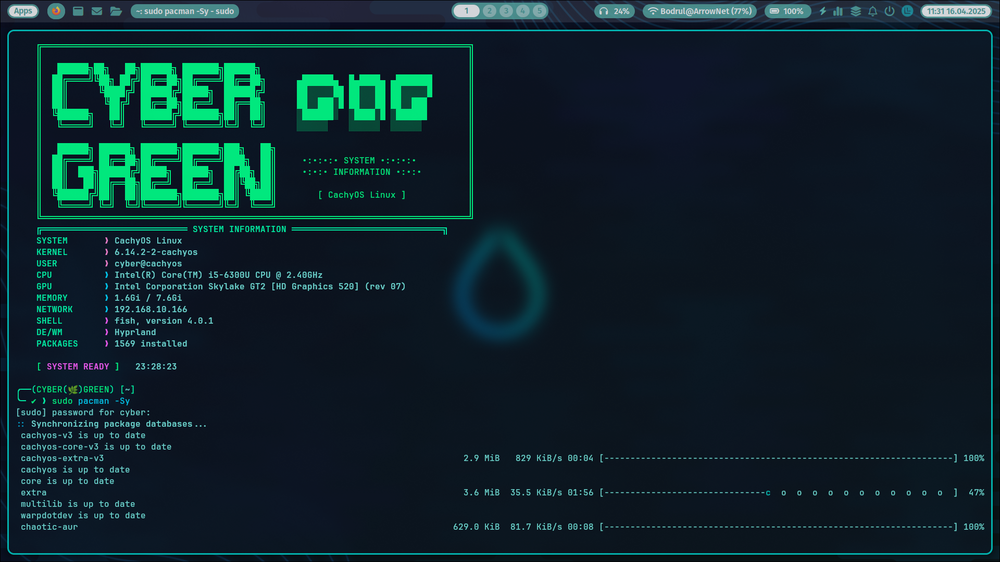
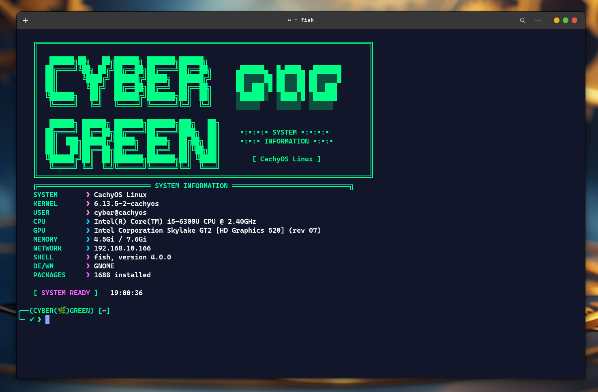

# 🌿 Cyber Green Fish Shell

A modern, productive Fish shell configuration focused on development workflow and system monitoring.



## ⚡ Quick Features

- Rich system information dashboard
- Smart command history search
- Directory bookmarking system
- Universal archive extraction
- Git-aware prompt with status
- Environment management

## 🎨 Visual Features

- Modern cyberpunk theme with gradients
- System resource monitoring
- Clean, informative prompt
- Status indicators and icons
- Hardware and software stats

## 🛠 Core Functions

| Command    | Description                          | Example                |
|------------|--------------------------------------|------------------------|
| `mark`     | Bookmark directory management        | `mark save projects`   |
| `extract`  | Universal archive extraction         | `extract file.tar.gz`  |
| `hf`       | Command history search               | `hf git commit`        |

## 🔧 System Integration

- **Development**: Flutter and Ruby support
- **Security**: Automatic SSH agent management
- **Environment**: Virtual env detection and display

## ⌨️ Custom Aliases

```fish
ll          → ls -la     
la          → ls -a      
cls         → clear
nv          → nvim
vi          → nvim
toc         → touch
sys-upgrade → sudo dnf upgrade
zi          → zed
zo          → zed .
logout      → hyprctl dispatch exit

```

## 📊 System Dashboard

Displays:
- 🖥️ Hardware stats (CPU, GPU, Memory, Disk)
- 🔧 System info (OS, Kernel, Packages)
- 🌐 Network status and configuration
- ⏱️ Time and uptime monitoring

## 🚀 Installation

1. Clone to your fish config directory:
   ```bash
   git clone https://github.com/Hadi493/fish-config ~/.config/fish
   ```
2. Source the configuration:
   ```fish
   source ~/.config/fish/config.fish
   ```

## 📦 Dependencies

- Fish Shell (>= 3.0.0)
- Git (for prompt features)
- Standard Unix utilities
